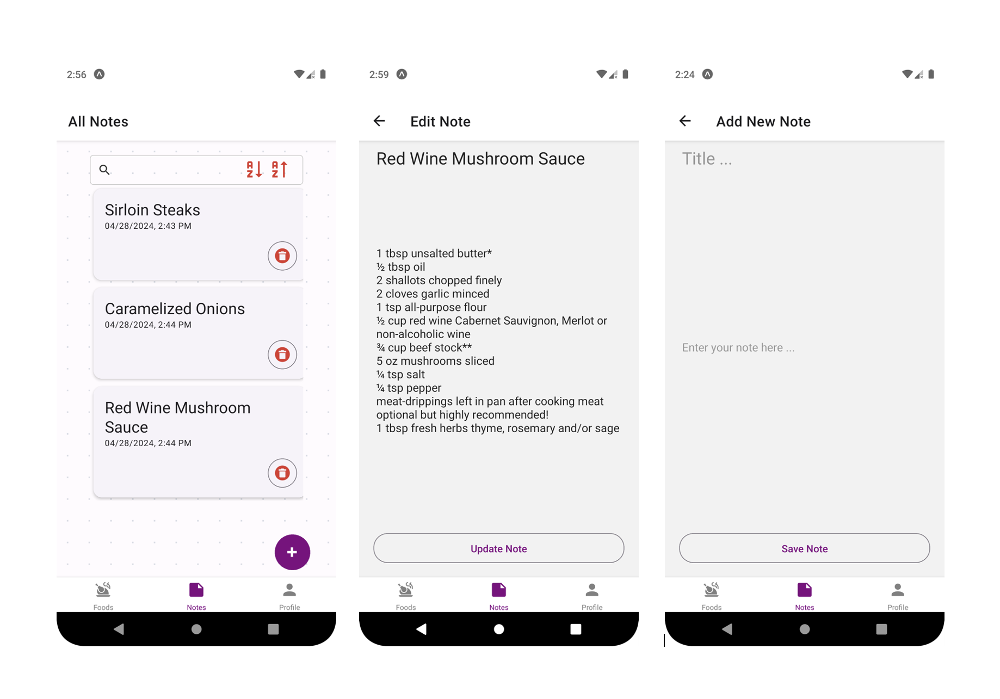

# Restaurant-Management-App

A hybrid mobile application project using React Native Technology. In front-end, the UI is developed using React Native framework. 

The backend REST API is using NodeJS, Express, MongoDB and Firebase. The github reposiotry is available [here](https://github.com/ksmaprince/Restaurant-Management-System).

## Some screenshots for App flow:

## Splash, Create Account Screens

## Register Success, Login, Home Screens

## Food Detail, Edit, Add New Food Screens

## All Notes, Edit, Add New Screens

## Profile, Edit, Change Password Screens

The github reposiotry for backend project is available [here](https://github.com/ksmaprince/Restaurant-Management-System).